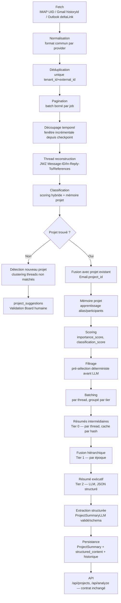
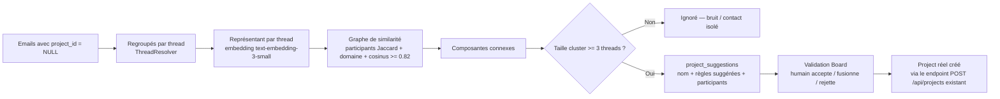
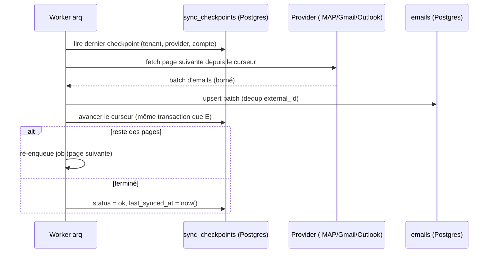
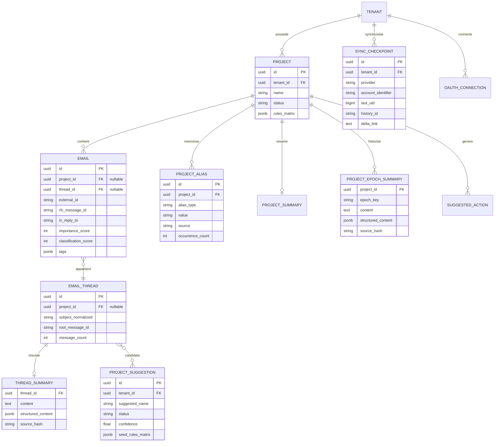
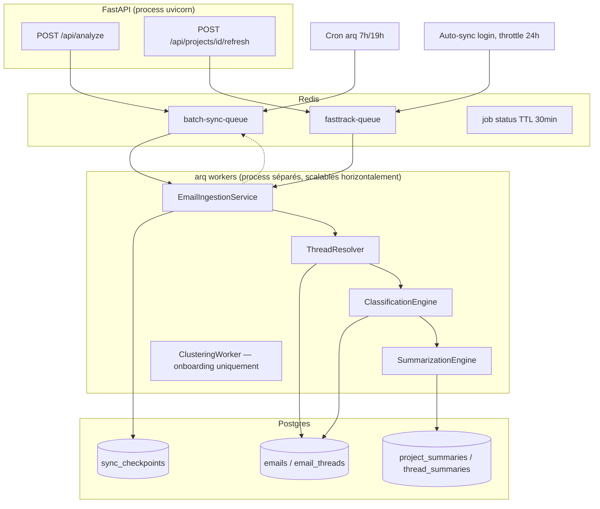
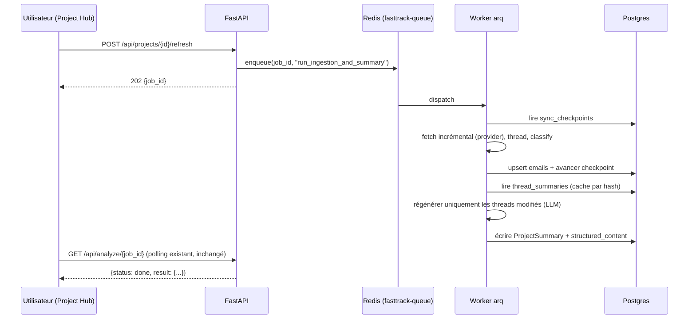
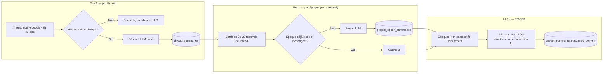

# RFC — Refonte du pipeline d'analyse d'emails (my-connector v2)

| | |
|---|---|
| **Statut** | Proposition (non implémentée) |
| **Périmètre** | `services/email_analyzer/` (backend Python/FastAPI + workers `arq`) |
| **Auteur** | Assistant IA (architecture), sur demande utilisateur |
| **Date** | 2026-07-11 |
| **Dépend de / cohérent avec** | `context/evolution-plan.md` (pgvector, files `arq`, Historical Clustering Worker, Validation Board — déjà décidés) |
| **Ne modifie pas** | `context/architecture.md`, `context/evolution-plan.md`, `context/project-overview.md` (incohérents entre eux, réconciliation volontairement différée — voir Unit 13 de `progress-tracker.md`) |

## 0. Résumé exécutif

Le pipeline actuel fonctionne pour un usage à faible volume mais ne tient pas la
promesse produit ("analyser plusieurs milliers d'emails sur plusieurs mois sans perte
d'information") pour quatre raisons structurelles, toutes vérifiées dans le code réel
de ce dépôt (pas des hypothèses) :

1. **Aucune synchronisation incrémentale réelle.** Le seul curseur existant est un
   timestamp (`ProjectSummary.last_processed_email_timestamp`) comparé côté Python à
   la date de l'email — pas un UID IMAP, pas un `historyId` Gmail, pas un delta token
   Outlook. Chaque "delta" ré-interroge une fenêtre large (`SINCE`) et refiltre.
2. **Gmail et Outlook sont plafonnés à 200 messages, une seule page, sans pagination**
   (`analyzer.py::_fetch_gmail_project_data`, `_fetch_outlook_project_data` — la
   limitation est documentée dans le code lui-même).
3. **Le threading n'existe pas** au sens propre : seule la normalisation du sujet
   (`Re:`/`Fwd:`/`Tr:`) regroupe les emails. `Message-ID` est extrait mais
   `In-Reply-To`/`References` ne le sont jamais.
4. **Le LLM ne reçoit et ne renvoie que du texte libre**, sans réduction hiérarchique
   au-delà d'un plafond de caractères — ça ne scale pas au-delà de quelques centaines
   d'emails par projet, et rien n'est mis en cache par contenu.

Ce document propose une cible en 9 phases indépendantes (§16), chacune livrable et
vérifiable séparément dans le style déjà pratiqué sur ce dépôt (unités ≤3 fichiers,
vérification contre Postgres/Redis réels avant de passer à la suite — voir l'historique
des "Unit 1..21" dans `context/progress-tracker.md`). Aucune des phases ne casse le
contrat `/api/analyze`, `/api/projects*`, `/api/chat` consommé par le frontend React
existant.

**Invariants traités comme contraignants** (issus de `context/architecture.md`, toujours
appliqués dans le code réel) :
- Un email appartient à **un seul** projet (pas de many-to-many `Email`↔`Project`).
- Aucun appel réseau lourd (IMAP/Gmail/Outlook/LLM) dans le thread de requête FastAPI —
  tout passe par la file `arq`.
- ORM uniquement (SQLAlchemy), jamais de SQL brut.
- Chiffrement des corps d'emails au repos : **actuellement non implémenté**
  (`Email.body_encrypted` est un commentaire, pas un fait — `db/models.py` l'admet) ;
  ce RFC ne l'aggrave pas et recommande de le fermer en Phase 0/1 conjointement avec
  `evolution-plan.md` Phase 1.

---

## 1. Analyse critique de l'existant

| # | Problème | Où (fichier / fonction) | Pourquoi ça arrive |
|---|---|---|---|
| 1 | Pas de pagination Gmail/Outlook, plafond dur 200 messages | `analyzer.py::_fetch_gmail_project_data`/`_fetch_outlook_project_data` ; `gmail_oauth.py::fetch_emails(max_results=200)` ; `outlook_oauth.py` `$top=200` | Un seul appel `messages().list()` / `$top=200` sans boucle sur `nextPageToken`/`@odata.nextLink` — l'intégration OAuth a été livrée (Units 1, 17) sans le mécanisme de pagination qui aurait dû l'accompagner. |
| 2 | Aucun curseur de synchronisation réel | `ProjectSummary.last_processed_email_timestamp` (`db/models.py`), comparé dans `analyzer.py::process_delta` | Le modèle de persistance (Unit 10) a été conçu pour la couche `ProjectSummary` avant que la logique de fetch par provider n'expose un vrai curseur (UID/historyId/deltaLink) — un timestamp est le plus petit dénominateur commun, pas le plus robuste. |
| 3 | Deux pipelines dupliqués (Full Analysis / Fast-Track) | `analyzer.py::process_latest_emails` vs `process_delta` ; `analysis_tasks.py::run_analysis_legacy/run_analysis_saas` vs `_run_fasttrack_sync` | Fast-Track (Unit 11) a été ajouté par-dessus le pipeline "legacy" existant sans le refactorer — chaque flux reconstruit son propre `EmailProjectAnalyzer` et rappelle indépendamment `generate_intelligent_summary`. Duplication complète de fetch→match→scoring→résumé. |
| 4 | Regroupement par sujet uniquement, pas de vrai threading | `project_mail.py::normalize_subject`/`group_emails_by_subject` | `In-Reply-To`/`References` ne sont jamais extraits de l'email brut (`extract_email_content`) — la fonctionnalité a été explicitement mise de côté (voir docstring du code, Unit 21) faute de temps, pas par choix de design. |
| 5 | Alias de projet non mémorisés durablement | `classification.py::score_project_relevance` (`known_participant`, 20pts) | Le "roster" de participants connus est reconstruit **à chaque scan** (`participants_map` local à `search_project_emails`) — rien n'est jamais réécrit sur `Project`. Aucune colonne d'alias/participants persistée n'existe. |
| 6 | Scoring effectué après coup, pas de pré-filtrage réel avant LLM | `project_mail.py::generate_intelligent_summary` | Le seul mécanisme de réduction avant l'appel LLM est un plafond de caractères et un "top 10 threads" — ce n'est pas un filtrage par pertinence/coût, c'est une troncature aveugle qui peut couper un thread critique récent au profit d'un vieux thread bavard. |
| 7 | Sortie LLM en texte libre | `llm.py::generate_openai_assistant_summary`/`generate_gemini_assistant_summary` → `{fournisseur, texte, modèle, erreur}` | Le prompt (`_EXECUTIVE_SYSTEM_PROMPT`) impose une structure en 5 sections mais rien ne la parse — le risque/les tags viennent d'une **passe séparée** basée sur des règles (`ai_intelligent.py`). La structure demandée au LLM est un artefact d'affichage, jamais exploitée en machine. |
| 8 | Aucune détection automatique de nouveaux projets | `api/routers/projects.py` (commentaire du code : "clustering automatique... non implémenté") | La création de projet est un CRUD manuel pur. Le "Zero-Touch Project Creation" du `project-overview.md` n'a jamais été construit — c'est un gap connu, pas une régression. |
| 9 | Couplage fort aux fournisseurs email | `analyzer.py::EmailProcessor.__init__` (priorité IMAP > Gmail > Outlook codée en dur, "arbitraire" selon le commentaire du code) | Chaque provider a son propre chemin de fetch avec sa propre logique de normalisation, dupliquée trois fois (`project_mail.py` pour IMAP, `gmail_oauth._normalize_message`, `outlook_oauth._normalize_message`) — pas d'interface commune de fetch. |
| 10 | Correspondance par sous-chaîne (faux positifs) | `classification.py`, mots-clés `risk_keywords` (`ai_intelligent.py`) | Matching par `in` (sous-chaîne) sans frontière de mot — ex. "rapidement" contient "api" → faux tag Technique. Limitation documentée dans le code (Unit 20), non corrigée par manque de périmètre à l'époque. |
| 11 | `ProjectSummary` non historisé | `db/models.py::ProjectSummary` (contrainte unique sur `project_id`) | Une seule ligne par projet, écrasée à chaque rafraîchissement — aucune table d'historique de résumés, impossible de comparer l'évolution d'un projet dans le temps ou de revenir sur un résumé antérieur. |
| 12 | Poids de scoring non calibrés | `classification.py::_SIGNAL_WEIGHTS`, `MATCH_THRESHOLD=45` | Premier jet raisonnable jamais confronté à un corpus étiqueté (admis explicitement dans `progress-tracker.md`, Unit 19/20) — aucune boucle de mesure precision/recall n'existe. |

**Synthèse des causes racines** : la plupart de ces problèmes ne viennent pas d'un
mauvais choix technique isolé, mais du **mode de livraison incrémental** déjà pratiqué
sur ce dépôt (petites unités, une fonctionnalité à la fois) appliqué sans revenir
ensuite unifier les fondations (fetch, curseur, threading) une fois que plusieurs
providers/plusieurs pipelines ont été ajoutés par-dessus. Ce RFC ne remet pas en cause
cette discipline de livraison — il l'applique à la refonte elle-même (§16) — mais
identifie explicitement le moment où les fondations doivent être unifiées **avant**
d'empiler une nouvelle fonctionnalité de plus (détection de projets, mémoire, résumé
hiérarchique) sur un socle qui ne tient pas la charge.

---

## 2. Nouvelle architecture — pipeline cible



**Explication étape par étape :**

- **Fetch** — remplace l'appel unique plafonné par un curseur durable par provider
  (§8). Chaque appel ramène uniquement ce qui est nouveau depuis le dernier checkpoint
  réussi.
- **Normalisation** — chaque provider produit déjà un format commun
  (`subject/from/to/date/body/normalized_text`, confirmé identique entre IMAP et Gmail
  aujourd'hui) ; formalisé comme contrat explicite d'interface plutôt qu'une
  convention implicite entre trois fichiers différents.
- **Déduplication** — déjà correcte (`Email.external_id` unique par tenant) : conservée
  telle quelle, c'est la seule brique de ce pipeline qui n'a pas besoin de changer.
- **Pagination / découpage temporel** — un job de sync traite un nombre de pages
  borné, puis se ré-enqueue pour la suite plutôt que de tout ramener en un seul appel
  — borne la durée d'un job `arq` et rend un crash récupérable à la page près.
- **Thread reconstruction** — JWZ (§4), avec repli heuristique seulement si les
  en-têtes sont absents/incohérents.
- **Classification** — le scorer additif existant (§7), étendu pour lire une mémoire
  projet persistante au lieu de la reconstruire à chaque scan.
- **Détection de nouveau projet** — les threads qui ne dépassent aucun seuil de
  matching alimentent le clustering (§5) au lieu d'être silencieusement ignorés.
- **Mémoire projet** — chaque email classé avec confiance suffisante enrichit
  `project_aliases` (§6) — le système s'améliore avec l'usage au lieu d'être figé au
  moment de la création du projet.
- **Scoring / Filtrage** — l'`importance_score`/`classification_score` déjà calculés
  (Units 19/20) deviennent un **filtre avant** l'appel LLM (ne résumer que ce qui
  compte), pas seulement une métadonnée d'affichage après coup.
- **Batching / Résumés intermédiaires / Fusion hiérarchique / Résumé exécutif** —
  remplace le "top 10 threads + troncature" par une hiérarchie à 3 paliers avec cache
  par contenu (§6, §10).
- **Extraction structurée** — sortie JSON validée par schéma (§11), au lieu d'un bloc
  de texte non exploitable en machine.
- **Persistance / API** — `ProjectSummary` gagne un historique et un champ structuré
  additifs ; les endpoints existants ne changent pas de forme (§12).

---

## 3. Architecture modulaire

| Composant | Responsabilité | Remplace / étend |
|---|---|---|
| **EmailIngestionService** | Fetch par provider via `sync_checkpoints`, normalisation commune, déduplication, pagination bornée par job | `EmailProcessor._fetch_gmail_project_data`/`_fetch_outlook_project_data`/IMAP direct |
| **ThreadResolver** | Reconstruction JWZ + fallback heuristique, écrit `email_threads`/`Email.thread_id` | `group_emails_by_subject` (conservé comme fallback interne, plus comme mécanisme unique) |
| **ProjectMemory** | Lecture/écriture de `project_aliases` (alias, participants, domaines appris), backfill depuis `rules_matrix` | remplace le `participants_map` éphémère de `project_mail.py` |
| **ClassificationEngine** | Scoring hybride (règles + mémoire projet), seuil de décision, traçabilité du score | `classification.py::score_project_relevance` (étendu, pas réécrit) |
| **ClusteringWorker** | Regroupe les threads non matchés (embeddings pgvector + graphe de similarité), produit des `project_suggestions` | nouveau — ferme le gap §1.8 |
| **SummarizationEngine** | Résumé à 3 paliers (thread → époque → exécutif), cache par hash de contenu | `generate_intelligent_summary` (décomposé) |
| **LLMOrchestrator** | Contrat JSON structuré (OpenAI Structured Outputs / Gemini `response_schema`), validation, retry, cache de prompt Redis | `llm.py` (étendu avec schéma, pas remplacé) |
| **RiskAnalyzer** | Score de risque déterministe (`ai_intelligent.calculate_risk_score`), comparé (jamais remplacé) au risque perçu par le LLM | `ai_intelligent.py` (conservé tel quel) |
| **ActionExtractor** | Dérive `SuggestedAction` depuis le résumé structuré (`echeances`/`recommandation`) | logique déjà dans `_run_fasttrack_sync`, extraite en fonction pure |
| **PersistenceLayer** | ORM SQLAlchemy, migrations Alembic additives | `db/models.py`, inchangé dans sa discipline |
| **Scheduler** | Cron `arq` (sync planifiée), auto-sync au login throttlé | `analysis_tasks.py::run_scheduled_sync`, `saas_logic.trigger_login_auto_sync` — conservés |
| **Worker Queue** | Deux files `arq` distinctes (`batch-sync-queue`, `fasttrack-queue`), déjà nommées dans `evolution-plan.md` | `jobs.py::enqueue` (étendu pour cibler la bonne file) |

---

## 4. Threading — reconstruction de fils de discussion

**Algorithme retenu : JWZ (variante de l'algorithme utilisé par Thunderbird/Gmail),
en-têtes d'abord, sujet en dernier recours.**

```
pour chaque email E (dans l'ordre de réception) :
    id = E.message_id                      # déjà extrait aujourd'hui
    parents_candidats = E.references[::-1] # dernier ID = parent direct le + fiable
    si parents_candidats vide :
        parents_candidats = [E.in_reply_to] si E.in_reply_to sinon []

    si parents_candidats non vide et parent trouvé dans l'index existant :
        rattacher E au thread du parent
    sinon si parents_candidats non vide (parent pas encore vu) :
        créer un "conteneur fantôme" pour le parent manquant (JWZ)
        rattacher E à ce conteneur — sera fusionné si le parent arrive plus tard
    sinon :
        # aucun en-tête ne résout — repli heuristique, PAS un simple match de sujet
        candidats = threads existants avec :
            normalize_subject(E.subject) == thread.subject_normalized
            ET jaccard(E.participants, thread.participants) >= 0.5
            ET |E.date - thread.last_email_at| <= 30 jours
        si un candidat unique dépasse le seuil combiné : rattacher
        sinon : nouveau thread racine
```

**Divergence assumée par rapport au comportement actuel** : aujourd'hui,
`normalize_subject` traite `Re:`, `Fwd:` et `Tr:` de façon identique — un email
transféré (`Fwd:`) rejoint donc le même "thread" que l'original dès que le sujet
correspond, même sans lien réel entre les deux conversations. Ce RFC change ce
comportement : un `Fwd:` ne rejoint le thread d'origine **que** s'il porte un vrai lien
`In-Reply-To`/`References` vers un message de ce thread. Sans ce lien, c'est un nouveau
thread (transfert vers un tiers = nouveau contexte, souvent nouveaux participants). Ceci
corrige un vrai bug de qualité de regroupement (des "Re: Réunion" sans rapport entre
eux, envoyés par des expéditeurs différents, peuvent aujourd'hui fusionner à tort).

`email_threads` reste une étiquette de regroupement — elle **n'introduit pas** de
relation many-to-many email↔projet : `Email.project_id` reste la source de vérité
unique par email (invariant préservé), le thread devient simplement un signal
supplémentaire dans le scoring (§7) et l'unité de résumé (§10).

---

## 5. Détection automatique de nouveaux projets

Le système ne doit plus attendre qu'un utilisateur crée le projet à la main. Pipeline,
cohérent avec le "Historical Clustering Worker" déjà nommé dans
`context/evolution-plan.md` (Phase 2, pgvector) :



**Pourquoi un graphe + composantes connexes plutôt qu'un k-means/DBSCAN à k fixe** : le
nombre de projets latents est inconnu à l'avance — un k fixe fragmenterait ou
fusionnerait arbitrairement des clusters. Une arête entre deux threads n'est posée que
si un score combiné (chevauchement de participants + domaine expéditeur + similarité
cosinus) dépasse un seuil — chaque fusion reste **auditable** ("pourquoi ces deux
threads ont fusionné"), dans le même esprit que le scoring explicable de `classification.py`.

**Pourquoi regrouper par thread avant de comparer, pas par email brut** : ça réduit N
emails non matchés à M threads (M ≪ N) avant toute comparaison coûteuse — nécessaire
pour rester praticable à l'échelle de millions d'emails.

**Toujours proposer, jamais créer automatiquement** — cohérent avec le principe déjà
appliqué à `SuggestedAction` ("jamais auto-exécutée") et avec l'invariant produit
"aucune action automatique sans validation humaine" (`project-overview.md`,
`evolution-plan.md` Phase 3). Un cluster accepté réutilise le endpoint `POST
/api/projects` existant, pré-rempli — aucun nouveau chemin d'écriture de `Project`.

**Coût maîtrisé** : le clustering complet (O(n²) sur les threads) n'est exécuté qu'une
fois, en tâche de fond bornée, lors de l'onboarding initial ("Historical Clustering
Worker"). Ensuite, chaque nouveau thread non matché est comparé **seulement** aux
clusters candidats déjà identifiés (croissance incrémentale du graphe), jamais à
l'historique complet.

---

## 6. Mémoire projet

**Table `project_aliases`** — accumule automatiquement ce que le pipeline apprend :

```python
class ProjectAlias(Base):
    __tablename__ = "project_aliases"
    id = Column(UUID, primary_key=True, default=uuid4)
    project_id = Column(UUID, ForeignKey("projects.id"), nullable=False, index=True)
    alias_type = Column(Enum(
        "keyword", "sender_email", "sender_domain", "client_name",
        "company_name", "reference_number", "participant",
        name="project_alias_type",
    ), nullable=False)
    value = Column(String, nullable=False)
    source = Column(Enum("manual", "learned", name="project_alias_source"), nullable=False)
    occurrence_count = Column(Integer, default=1, nullable=False)
    first_seen_at = Column(DateTime, nullable=False)
    last_seen_at = Column(DateTime, nullable=False)

    __table_args__ = (
        UniqueConstraint("project_id", "alias_type", "value", name="uq_project_alias"),
    )
```

- **Backfill** (migration à sens unique, Phase 4) : chaque entrée de
  `Project.rules_matrix` devient une ligne `source='manual'`. `rules_matrix` reste la
  surface d'écriture du formulaire existant (`PATCH /api/projects/{id}`, inchangé) —
  le scoring lit désormais `project_aliases`, alimenté à la fois par les règles
  manuelles et par l'apprentissage automatique.
- **Job d'apprentissage** (exécuté après chaque sync) : pour chaque `Email` persisté
  avec `classification_score >= 70` (nettement au-dessus du `MATCH_THRESHOLD=45` actuel
  — pour ne jamais laisser un match limite polluer la mémoire) et un `project_id`
  résolu, upsert de ses participants/domaine dans `project_aliases`
  (`source='learned'`, incrémente `occurrence_count`). Un alias appris n'influence le
  scoring qu'à partir de `occurrence_count >= 2` (rejette le bruit d'un CC isolé).
- Ce que la mémoire projet accumule (répond directement à la demande) : alias,
  participants, entreprises/clients (via `client_or_company_name`), domaines, numéros de
  référence — tout ce qui est déjà un signal dans `classification.py`, désormais
  persisté au lieu d'être recalculé à vide à chaque scan. Documents/tickets/contrats/
  acronymes/vocabulaire spécifique : hors périmètre de ce RFC (nécessite le parsing de
  pièces jointes, explicitement non implémenté aujourd'hui — signalé comme extension
  future, pas traité ici pour ne pas mélanger deux chantiers).

---

## 7. Matching intelligent

Le scorer additif actuel (`classification.py::score_project_relevance`) est **conservé
comme colonne vertébrale**, pas remplacé — il est explicable (chaque point de score est
attribuable à un signal précis) et déjà branché sur un formulaire utilisateur éditable
(`rules_matrix`). Ce qui change :

| Signal | Aujourd'hui | Cible |
|---|---|---|
| Nom du projet dans le texte | 45 pts, sous-chaîne | inchangé (bit-à-bit rétrocompatible) |
| Mot-clé | 20 pts, sous-chaîne sans frontière de mot | passage à une regex à frontière de mot (`\bmot\b`) — corrige le faux positif "rapidement" → "api" |
| Email/domaine expéditeur | 25/20 pts | inchangé |
| Participant connu | 20 pts, recalculé par scan | **lu depuis `project_aliases`** (mémoire persistante, §6) |
| Nom client/société | 15 pts | inchangé |
| Référence interne | 25 pts | inchangé |
| **Continuité de thread** *(nouveau)* | — | +10 pts si l'email appartient à un thread déjà rattaché à ce projet (`email_threads.project_id`) — un signal de plus, jamais suffisant seul |
| **Similarité sémantique** *(nouveau, différé)* | — | utilisée en §5 pour la détection de *nouveaux* projets, **pas** injectée ici tant que le scorer actuel n'est pas calibré sur un corpus étiqueté |

**Pourquoi ne pas mettre les embeddings dans le scorer de matching maintenant** : le
défaut documenté du scorer actuel est un bug de frontière de mot, pas un problème de
similarité sémantique — les embeddings ne corrigent pas ce type de faux positif, ils en
introduisent un autre (confondre "livraison urgente" et "facture urgente"). Empiler une
seconde dimension difficile à déboguer sur une première jamais calibrée
(`MATCH_THRESHOLD=45` choisi à vue) aggraverait le problème de calibration au lieu de le
résoudre. Calibrer d'abord le scorer déterministe sur un petit jeu étiqueté ; les
embeddings sont de toute façon nécessaires ailleurs (§5, détection de nouveaux projets,
où il n'existe justement **aucune** règle à matcher) — les introduire là où
l'infrastructure pgvector sera de toute façon construite et validée, avant de les
réutiliser ici si un besoin réel est mesuré.

**Le score reste expliqué** : chaque `Email.classification_score` persiste, en plus du
total, le détail des signaux qui l'ont produit (`Email.match_breakdown` JSONB, nouveau
champ nullable) — nécessaire pour que l'utilisateur comprenne pourquoi un email a (ou
n'a pas) été rattaché à un projet, condition déjà implicite dans le principe "score
auditable" du code actuel.

---

## 8. Analyse incrémentale

**Principe : un curseur durable et spécifique au provider, jamais un simple timestamp
comparé côté client.**

| Provider | Curseur | Mécanisme de reprise |
|---|---|---|
| IMAP | `UIDVALIDITY` + dernier `UID` traité | `UID FETCH last_uid+1:*` ; si `UIDVALIDITY` a changé (boîte renumérotée), reset et resync complet |
| Gmail | `historyId` | `users.history.list(startHistoryId=...)`, pagination complète ; si l'historique a expiré (`404`), repli sur un balayage complet paginé (`nextPageToken`) puis reset du `historyId` |
| Outlook | `@odata.deltaLink` | appel direct du deltaLink stocké ; sur `410 Gone`, même repli qu'au-dessus (`messages/delta` sans token, suivi de `@odata.nextLink`) |

**Table `sync_checkpoints`** (Postgres, pas Redis) :

```python
class SyncCheckpoint(Base):
    __tablename__ = "sync_checkpoints"
    id = Column(UUID, primary_key=True, default=uuid4)
    tenant_id = Column(UUID, ForeignKey("tenants.id"), nullable=False)
    provider = Column(Enum("imap", "gmail", "outlook", name="sync_provider"), nullable=False)
    account_identifier = Column(String, nullable=False)   # adresse email du compte
    folder = Column(String, nullable=True)                 # IMAP seulement
    uidvalidity = Column(BigInteger, nullable=True)
    last_uid = Column(BigInteger, nullable=True)
    history_id = Column(String, nullable=True)              # Gmail
    delta_link = Column(Text, nullable=True)                 # Outlook
    status = Column(Enum("ok", "resync_required", "error", name="checkpoint_status"), default="ok")
    last_synced_at = Column(DateTime, nullable=True)
    last_error = Column(Text, nullable=True)

    __table_args__ = (
        UniqueConstraint("tenant_id", "provider", "account_identifier", "folder",
                          name="uq_sync_checkpoint"),
    )
```

**Pourquoi Postgres et pas Redis** (alternative sérieusement considérée, car `jobs.py`
héberge déjà l'état des jobs et le throttle d'auto-sync côté Redis) : Redis ici est
volatil par construction — TTL de 30 min sur les jobs, 24h sur le throttle. Une
éviction ou un redémarrage Redis ferait silencieusement retomber un tenant sur un
resync complet, ce qui à l'échelle visée (millions d'emails) est un incident de coût et
de correction, pas un simple inconfort. Le checkpoint doit avoir la même garantie de
durabilité que les lignes `Email` qu'il protège de la réingestion.

**Reprise après crash** : le checkpoint n'avance **qu'après** le commit du batch
d'emails qu'il couvre — idéalement dans la même transaction. Un crash en cours de sync
ne perd donc au pire qu'un seul batch en vol ; la contrainte unique déjà en place sur
`(tenant_id, external_id)` rend un rejeu de ce batch sûr (`INSERT ... ON CONFLICT`
absorbé par la contrainte, pas de doublon).

**Synchronisation partielle** : chaque exécution de job traite un nombre borné de
pages (budget par invocation), puis se ré-enqueue pour la suite plutôt que de tenter
de tout ramener en un seul appel arq — ceci borne aussi la durée d'un job individuel
(pertinent pour les mailboxes de plusieurs dizaines de milliers d'emails).



---

## 9. Gestion des gros volumes

| Volume | Stratégie |
|---|---|
| ~100 emails | Pipeline complet en un seul job — pas de découpage nécessaire, résumé exécutif direct (Tier 2 seul). |
| ~500 | Idem, threading actif ; premiers effets du cache Tier 0 si des threads sont déjà stables. |
| ~1 000 | Résumé à 3 paliers activé pleinement — Tier 0 (par thread) + Tier 1 (par époque) avant le résumé exécutif. |
| ~5 000 | Fetch paginé par batch de 500 (IMAP UID range / Gmail history pages / Outlook delta pages), job re-enqueué entre les pages. Clustering incrémental (§5) actif si des threads restent non matchés. |
| ~10 000 | Idem + budget explicite de pages par invocation de job arq pour ne jamais dépasser la durée max d'un job. Cache Tier 0/Tier 1 devient déterminant pour le coût (la majorité des threads sont déjà résumés et inchangés). |
| ~50 000+ | Le coût d'un résumé exécutif redevient **fonction de l'activité courante, pas de l'historique total** (Tier 2 ne consomme que les époques + threads actifs) — c'est le mécanisme central qui rend ce volume traitable sans réexploser le budget LLM à chaque sync. Le clustering initial (onboarding) reste la seule opération véritablement O(n²)-sensible ; elle est explicitement bornée en tâche de fond unique, jamais répétée. |

**Streaming plutôt que chargement complet en mémoire** : le fetch par page + la
persistance immédiate (au lieu d'accumuler tous les emails en mémoire avant traitement,
comme le fait aujourd'hui `search_project_emails` qui matérialise la liste complète)
évite qu'un mailbox de 50 000 messages fasse gonfler la mémoire d'un worker.

---

## 10. Optimisation des coûts LLM

**Principe directeur : tout ce qui peut être décidé sans LLM doit l'être avant tout
appel LLM.**

Ce qui doit être fait **sans** LLM (déterministe, déjà en grande partie le cas
aujourd'hui, à consolider) :
- Filtrage par `importance_score`/`classification_score` (déjà calculés sans coût
  réseau, Units 19/20) — ne construire le corpus LLM qu'à partir des threads dont au
  moins un email dépasse un seuil de pertinence.
- Détection de risque de base (mots-clés) — reste la source de vérité, comparée au
  risque LLM (§11), jamais remplacée.
- Regroupement par thread, déduplication, tags de classification.
- Décision de "ce thread a-t-il changé depuis le dernier résumé" (hash de contenu).

Ce qui reste au LLM : synthèse, formulation des décisions/risques/échéances,
recommandation priorisée — tout ce qui demande une compréhension du langage naturel, pas
une classification.

**Réduction du volume envoyé** :
1. **Cache par hash de contenu** (pas de TTL) — un résumé de thread (Tier 0) n'est
   régénéré que si le hash de l'ensemble ordonné des `message_id` du thread a changé.
   Un TTL gaspillerait le budget à re-résumer des threads dormants (la majorité de
   l'historique d'un projet mature) et sous-rafraîchirait un thread actif dont le
   rythme dépasse la fenêtre TTL.
2. **Résumés incrémentaux** — seuls les threads modifiés depuis la dernière sync sont
   soumis au Tier 0 ; les époques déjà closes (Tier 1) ne sont jamais régénérées.
3. **Fusion hiérarchique** (§9) — le résumé exécutif ne consomme que les sorties déjà
   condensées des paliers inférieurs, pas les emails bruts.
4. **Cache de prompt Redis par hash** (déjà nommé dans `evolution-plan.md` Phase 2) —
   protège contre un appel identique répété dans une fenêtre courte (ex. deux
   rafraîchissements rapprochés sans changement de contenu).
5. **Modèle économique pour le pré-clustering, modèle complet pour l'analyse à la
   demande** — cohérent avec la matrice de risques d'`evolution-plan.md`
   ("gpt-4o-mini pour le pré-clustering/qualification, gpt-4o standard réservé aux
   analyses fines").

---

## 11. Structure JSON — contrat de sortie LLM

Remplace le bloc `{fournisseur, texte, modèle, erreur}` actuel. Schéma versionné (`schema_version`
permet une évolution sans casser les résumés déjà persistés) :

```json
{
  "schema_version": 1,
  "synthese": "Le projet RecoPro est globalement sur les rails, une échéance de livraison approche.",
  "points_cles": [
    "Livraison du module de facturation confirmée pour le 15/08",
    "Le client a validé la maquette v2"
  ],
  "decisions": [
    {"description": "Report de la démo au 20/08", "date_iso": "2026-08-05", "confidence": "haute"}
  ],
  "risques": [
    {"description": "Dépendance non livrée par le sous-traitant", "niveau": "critique", "source": "regle+llm"}
  ],
  "next_steps": [
    {"description": "Relancer le sous-traitant", "responsable": "PM", "priorite": "haute"}
  ],
  "deadlines": [
    {"description": "Livraison module facturation", "date_iso": "2026-08-15", "confiance": "haute"}
  ],
  "participants": ["alice@client.com", "bob@fournisseur.com"],
  "companies": ["ClientCo", "SousTraitantSARL"],
  "products": ["Module Facturation v2"],
  "sentiment": "under_tension",
  "sentiment_trend": "stable",
  "llm_risk_level": "modere",
  "confidence": 0.78,
  "missing_information": ["Date de disponibilité du correctif sous-traitant non communiquée"],
  "project_updates": ["Nouveau contact identifié côté client : bob@fournisseur.com"]
}
```

**Améliorations par rapport au modèle proposé dans la demande initiale** :
- `schema_version` pour permettre l'évolution du schéma sans migration bloquante.
- `risques`/`deadlines`/`decisions` sont des objets structurés (pas de simples chaînes)
  — chacun porte sa propre confiance/date, exploitable pour trier ou filtrer côté API.
- `llm_risk_level` **distinct** de `sentiment` (qui reste dérivé des règles,
  `ai_intelligent.calculate_risk_score`) — jamais fusionnés silencieusement, un
  désaccord entre les deux est un signal en soi (voir garde-fou ci-dessous).
- `missing_information` et `project_updates` conservés tels que proposés — utiles pour
  distinguer "ce que le LLM ne sait pas" de "ce qui a changé depuis le dernier résumé".

**Obtention fiable** (OpenAI **et** Gemini, les deux déjà appelés dans `llm.py`) :
- **OpenAI** — Structured Outputs (`response_format={"type": "json_schema", "strict":
  true}` avec le modèle Pydantic `ProjectSummaryLLM`), garantit une sortie conforme au
  schéma par construction plutôt que par un parsing best-effort.
- **Gemini** — `generation_config.response_mime_type="application/json"` +
  `response_schema=ProjectSummaryLLM` (déjà supporté par `google.generativeai`, déjà
  importé dans `llm.py`).
- **Validation + retry** — 1 à 2 tentatives sur `ValidationError` ou sur troncature
  détectée (le code détecte déjà ce cas côté Gemini,
  `_gemini_candidate_hits_max_tokens`) avant de retomber sur le "mode économie" existant
  (corpus réduit) puis, en dernier recours, sur un statut d'erreur explicite — même
  posture que le champ `erreur` actuel, étendue aux échecs de schéma.

**Garde-fou explicite (à ne pas violer)** : `llm_risk_level` ne remplace **jamais**
`ai_intelligent.calculate_risk_score`. Les deux sont stockés ; une `SuggestedAction` de
type "risque" n'est escaladée automatiquement que si les deux sont d'accord —
sinon elle est créée avec un statut `needs_review` plutôt que `pending`. Ceci préserve
le filet de sécurité déterministe déjà en place (le risque ne dépend pas aujourd'hui de
la justesse du LLM) tout en rendant le jugement structuré du LLM additif.

---

## 12. Base de données — nouveaux modèles



**Nouvelles tables** : `sync_checkpoints` (§8), `email_threads` (§4),
`project_aliases` (§6), `project_suggestions` + `project_suggestion_threads` (§5, table
de jointure plutôt que colonne tableau — reste filtrable proprement en ORM pur, sans
opérateurs SQL sur array qui pousseraient vers du SQL brut, interdit par
`code-standards.md`), `thread_summaries` et `project_epoch_summaries` (§10).

**Colonnes additives, toutes nullables** — même discipline que les migrations
existantes 004/005 (`emails.importance_score`, `emails.tags` — ajoutées sans backfill
des lignes historiques) :
- `emails` : `thread_id`, `rfc_message_id`, `in_reply_to`, `references_raw`,
  `match_breakdown` (JSONB).
- `project_summaries` : `structured_content` (JSONB), `llm_risk_level`,
  `schema_version` (défaut `1`).

**Stabilité du contrat pendant le rollout** : `/api/projects`, `/api/projects/{id}`,
`/api/analyze`, `/api/analyze/{job_id}` conservent leurs schémas Pydantic de réponse
inchangés à chaque phase. Les nouvelles capacités arrivent par de **nouveaux**
endpoints (`GET /api/projects/{id}/threads`, `GET /api/project-suggestions`,
`POST /api/project-suggestions/{id}/accept`) plutôt que par la modification des
réponses existantes — même pattern que l'ajout de `classification_score`/`tags` à
`EmailOut` en migration 005 (champs optionnels additifs, aucun consommateur existant
cassé). `ProjectSummary.last_processed_email_timestamp` reste exposé tel quel ; seule
sa signification interne évolue, une fois `sync_checkpoints` devenu le vrai curseur, de
"le curseur" vers "date de la dernière sync réussie" — transition compatible côté API.

---

## 13. Pipeline distribué

La stack réelle du dépôt est **`arq` + Redis** (pas Celery/RabbitMQ — décision déjà
actée dans `context/architecture.md` Unit 8/9 : `arq` a été choisi car asyncio-natif,
cohérent avec le FastAPI async existant ; revenir sur Celery/RabbitMQ maintenant
signifierait réintroduire un paradigme synchrone dans une base entièrement asyncio,
sans bénéfice pour la charge visée — arq scale horizontalement en ajoutant des process
workers, ce qui suffit jusqu'à plusieurs dizaines de workers par tenant-shard).



**Deux files distinctes** (déjà nommées dans `evolution-plan.md`) — `batch-sync-queue`
pour la sync planifiée/de fond (débit, pas de latence garantie), `fasttrack-queue` pour
les rafraîchissements à la demande (priorité, l'utilisateur attend un retour rapide sur
la carte projet). Un worker Kubernetes peut être dimensionné par file indépendamment
(plus de replicas sur `fasttrack-queue` aux heures ouvrées, par exemple), ce qui reste
compatible avec un déploiement futur sur K8s sans changement de code — `arq` ne
présuppose pas d'orchestrateur particulier, juste un Redis partagé.

---

## 14. Gestion des erreurs

| Situation | Comportement cible |
|---|---|
| Crash worker en cours de sync | Reprise au dernier checkpoint durable (Postgres) — au pire un batch à rejouer, absorbé par la contrainte unique `(tenant_id, external_id)` (§8). |
| Timeout LLM | Déjà géré (`LLM_TIMEOUT_SECONDS`, `IMAP_TIMEOUT_SECONDS`) — étendu avec le retry validate-and-retry du contrat JSON (§11). |
| Erreur Gmail (historique expiré, `404`) | Repli automatique sur balayage complet paginé, reset du `historyId` (§8) — jamais un échec silencieux. |
| Erreur Outlook (`410 Gone` sur le deltaLink) | Même repli que Gmail (§8). |
| Erreur IMAP (déconnexion, `UIDVALIDITY` changé) | Détection du changement de `UIDVALIDITY` → resync complet forcé pour ce compte uniquement (pas pour le tenant entier). |
| Échec d'un projet dans la sync planifiée par lot | Déjà correct aujourd'hui (`run_scheduled_sync` logge et continue, Unit 18) — comportement conservé à l'identique. |
| Retry `arq` | Réactivé (`max_tries` > 1) une fois les tâches réellement idempotentes par construction (dédup + checkpoint transactionnel) — aujourd'hui `max_tries=1` car les tâches ne le sont pas (comportement documenté, Unit 21 "fix timeout"). Un retry sur une tâche idempotente ne fait que rejouer un travail déjà en grande partie absorbé par les contraintes uniques, sans double coût LLM (le cache par hash, §10, évite de repayer un résumé déjà généré). |
| Désaccord risque règles vs LLM | `SuggestedAction.status = needs_review` plutôt qu'une escalade automatique silencieuse (§11). |

**Idempotence par construction, pas par exception** : la conception entière (dédup
`external_id`, checkpoint transactionnel, cache par hash de contenu) rend un rejeu
naturellement sûr et peu coûteux, plutôt que de compter sur une logique de
retry/rollback ad hoc ajoutée après coup.

---

## 15. Diagrammes complémentaires

**Flux de données bout-en-bout (cas Fast-Track déclenché depuis le Project Hub) :**



**Pipeline LLM (map-reduce à 3 paliers) :**



*(Les diagrammes "architecture globale", "workers/files" et "modèle de données" sont
donnés respectivement en §2, §13 et §12 — non dupliqués ici.)*

---

## 16. Roadmap — 9 phases indépendantes

Chaque phase suit la discipline déjà en place sur ce dépôt (`ai-workflow-rules.md` §2 :
unités ≤3 fichiers/≤150 lignes, séquence Data→Core→Tasks→Endpoints→Frontend,
vérification contre Postgres/Redis réels avant de passer à la suite — voir
`progress-tracker.md`, Units 1 à 21).

| Phase | Contenu | Changement de comportement visible ? |
|---|---|---|
| **0 — Fondations** | Table `sync_checkpoints` (migration seule) ; colonnes `emails.thread_id`/`rfc_message_id`/`in_reply_to`/`references_raw` (nullable, migration seule) ; extraction de `In-Reply-To`/`References` dans `extract_email_content`, écriture seule, aucune logique de threading encore branchée. | Non. |
| **1 — IMAP incrémental réel** | Logique UIDVALIDITY/UID testée en isolation contre un serveur IMAP réel/dockerisé ; exécution en "shadow" à côté du chemin `SINCE` actuel, diff des résultats ; bascule de `process_delta` (IMAP) seulement après validation. | Oui, mais transparent pour l'utilisateur (mêmes résultats, moins de requêtes). |
| **2 — Gmail puis Outlook incrémental** | Même pattern shadow-puis-bascule, un provider à la fois (`historyId`, puis `deltaLink`) ; suppression du plafond 200 dans la même unité que l'ajout de la pagination réelle. | Oui : les tenants Gmail/Outlook avec >200 emails voient enfin leur historique complet. |
| **3 — Threading** | JWZ en fonction pure, testé sur des chaînes d'en-têtes construites (aucune persistance) ; puis `email_threads` + branchement dans l'ingestion (Phase 1/2) ; puis le repli heuristique (unité séparée, logique plus sensible). | Oui : les résumés commencent à regrouper par vrai fil de discussion. |
| **4 — Mémoire projet** | `project_aliases` + backfill depuis `rules_matrix` (additif, rien ne le lit encore) ; extension de `score_project_relevance` pour lire la mémoire, comparée en shadow au comportement actuel avant bascule ; job d'apprentissage post-sync. | Oui : le matching s'améliore progressivement avec l'usage. |
| **5 — Contrat LLM structuré** | Chemin OpenAI Structured Outputs (additif — `structured_content` rempli à côté de `content` inchangé) ; miroir Gemini `response_schema` ; validation+retry et le garde-fou de désaccord risque LLM/règles (unité séparée, revue dédiée vu l'impact sécurité/fiabilité). | Non pour l'utilisateur final immédiatement (champ additif) ; ouvre la voie à un futur affichage structuré. |
| **6 — Résumé hiérarchique** | `thread_summaries` + génération conditionnée au hash ; `project_epoch_summaries` + fusion mensuelle ; bascule du résumé exécutif pour consommer les Tiers 0/1 — livré en dernier dans la phase car c'est l'unité la plus susceptible de changer visiblement la qualité de sortie, une fois la plomberie moins chère déjà validée. | Oui : qualité et coût du résumé exécutif changent notablement. |
| **7 — Détection automatique de projets** | Infrastructure pgvector + embeddings de threads (unité infra seule) ; job de clustering par composantes connexes produisant des `project_suggestions` (vérifiable en base avant toute UI) ; `GET /api/project-suggestions` + accept/reject ; Validation Board frontend (déjà nommée dans `evolution-plan.md` Phase 2) livrée en dernier. | Oui : nouvelle fonctionnalité visible (bannière de suggestions). |
| **8 — Fusion Full Analysis / Fast-Track** | Extraction de `EmailIngestionService`/`SummarizationEngine` comme fines couches autour de ce que les phases 1-7 ont déjà validé indépendamment ; bascule de `/api/analyze` et `/api/projects/{id}/refresh` vers ces services communs ; suppression du code dupliqué seulement après au moins un cycle de sync "shadow" complet par type de provider et par tenant. **Volontairement en dernier** — changer le routage en même temps que les fondations serait exactement le type de changement groupé que la discipline de ce dépôt interdit. | Oui, changement documenté : `/api/analyze` cesse d'être strictement "sans état" (il persiste désormais, en s'appuyant sur le backfill incrémental déjà prouvé) — signalé explicitement, pas un effet de bord silencieux. |

### Quick Wins vs Long Terme

| | Quick Wins (faible effort, gain immédiat) | Long Terme (fondation à investir) |
|---|---|---|
| **Sync** | Retirer le plafond 200 Gmail/Outlook en ajoutant une simple boucle de pagination sans encore changer le modèle de curseur (gain immédiat, avant même la Phase 2 complète) | Curseurs durables par provider (Phase 1-2) |
| **Matching** | Corriger le matching par sous-chaîne avec une frontière de mot (`\bmot\b`) — un changement d'une ligne dans `classification.py`, referme un faux positif documenté | Mémoire projet persistante (Phase 4) |
| **LLM** | Activer le cache de prompt Redis par hash (déjà nommé dans `evolution-plan.md`, aucune dépendance sur le reste de ce RFC) | Contrat JSON structuré + résumé hiérarchique (Phases 5-6) |
| **Fiabilité** | Documenter/exposer l'incohérence connue entre `context/architecture.md`/`evolution-plan.md` et le code réel (déjà fait dans ce document, §0) | Fusion des deux pipelines (Phase 8) |
| **Produit** | — | Détection automatique de projets + Validation Board (Phase 7) |

---

## Annexe A — Ce que ce RFC ne couvre pas (hors périmètre assumé)

- Parsing de pièces jointes (PDF/Excel) pour enrichir la mémoire projet (documents,
  contrats) — dépend d'un chantier de parsing non existant aujourd'hui, à traiter
  séparément.
- Chiffrement effectif de `Email.body_encrypted` — déjà identifié comme dette dans
  `evolution-plan.md` Phase 1 ; ce RFC ne le résout pas mais s'assure de ne pas
  l'aggraver (aucune nouvelle colonne en clair introduite sans suivre le même schéma
  additif/nullable que l'existant).
- Rate-limiting/circuit breaker par tenant (Token-Bucket Redis) — déjà spécifié dans
  `evolution-plan.md` Phase 2, orthogonal à ce pipeline, non redétaillé ici.
- Moteur de brouillons de réponse — `evolution-plan.md` Phase 3, dépend du présent RFC
  (résumé structuré, mémoire projet) mais n'est pas traité comme une phase de ce
  document.

## Annexe B — Fichiers de référence vérifiés pour produire ce RFC

`project_mail.py`, `analyzer.py`, `analysis_tasks.py`, `classification.py`, `llm.py`,
`ai_intelligent.py`, `jobs.py`, `gmail_oauth.py`, `outlook_oauth.py`, `saas_logic.py`,
`db/models.py`, `api/routers/projects.py`, `config.py` (tous sous
`services/email_analyzer/`), ainsi que `context/architecture.md`,
`context/evolution-plan.md`, `context/progress-tracker.md` (Units 1-21).
